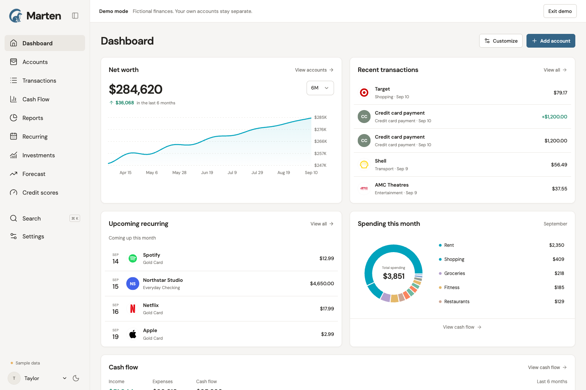

# Marten

A calm, modern personal finance app for one household. Connect your banks or import a spreadsheet, then see your accounts, spending, recurring bills, investments, credit scores, and a forecast of the years ahead in one place. Free, open source, no ads, no selling data, no tracking.



## What Marten does

- **Accounts** — checking, savings, credit cards, loans, brokerage, and IRAs, with net worth over time.
- **Transactions** — search, categories, tags, notes, splits, receipts, merchant logos, and ordered rules that categorize new activity for you.
- **Cash flow and reports** — income against expenses, spending by category and merchant, and complete-period totals you can trust.
- **Recurring** — subscriptions and bills detected from your history, with statement due dates and optional reminders.
- **Investments** — holdings, allocation, cost basis, and activity for connected brokerage accounts.
- **Forecast** — retirement ages, annual travel, required savings, and near-term cash balances, with every assumption visible.
- **Credit scores** — a history you keep yourself from the free scores your card issuers and bureaus already give you.
- **AI-assistant connections** — let an assistant you already use read (and, with separate consent, edit) your finances through the browser or a remote MCP connection. Marten runs no model and needs no model API key.
- **Spreadsheet import** — Excel and CSV, including Monarch Money exports, with column matching, previews, and duplicate handling.

Every signed-in person gets a private workspace. There is no household sharing yet. Trading, automated financial advice, and tax filing are outside its scope.

## Why it exists

I built Marten for my family. We wanted something modern and simple that did not cost about $100 a year the way Monarch Money does, and that did not mean typing every purchase into a spreadsheet. In the United States, bank data is not open: apps reach it through an aggregator such as Plaid or SimpleFIN, so Marten lets you choose one and keeps the rest free.

## Two ways to use it

|               | Hosted Marten site                                                                                                   | Self-hosted                                                                                       |
| ------------- | -------------------------------------------------------------------------------------------------------------------- | ------------------------------------------------------------------------------------------------- |
| Who runs it   | Drew hosts a public instance for anyone who wants an account <!-- TODO: confirm domain -->                           | You, for your own household                                                                       |
| Cost          | Free. Bank connections use your own SimpleFIN Bridge subscription (about $1.50/month or $15/year, paid to SimpleFIN) | Free tiers of Convex and a static host; a domain if you want one; Plaid's free Trial or SimpleFIN |
| Bank provider | SimpleFIN Bridge. Plaid on the hosted site is reserved for the operator's family                                     | Your choice: Plaid (your own free Trial credentials), SimpleFIN, or manual and spreadsheet only   |
| Get started   | Create an account on the hosted site, or try `/demo` first                                                           | Follow the [self-hosting guide](docs/self-hosting.md)                                             |

Either way you can start with manual accounts and spreadsheet imports and connect a bank later.

## Bank providers compared

|                | Plaid                                                                                            | SimpleFIN Bridge                                                                             | Manual and spreadsheets                         |
| -------------- | ------------------------------------------------------------------------------------------------ | -------------------------------------------------------------------------------------------- | ----------------------------------------------- |
| Who pays       | The deployment operator; free Trial, then pay-as-you-go                                          | Each user, directly to SimpleFIN                                                             | Nobody                                          |
| Who sets it up | The operator, once, with developer credentials                                                   | Each user, in their own SimpleFIN account                                                    | Nobody                                          |
| Limit          | 10 institution logins per Trial, for the whole deployment, ever                                  | Up to 25 institutions and 25 apps per subscription (SimpleFIN's advertised terms)            | None                                            |
| Data           | Balances, transactions, credit statements and minimum payments, investment holdings and activity | Balances and posted transactions with merchant category codes; holdings are not imported yet | Whatever you enter or import                    |
| Freshness      | Webhooks plus a six-hour catch-up sweep                                                          | Once a day, plus **Import latest** on demand                                                 | You                                             |
| Best for       | The operator's own household                                                                     | Everyone else on a shared deployment, or a self-hoster who would rather not manage Plaid     | Getting started, or accounts no provider covers |

Details and sources: [bank provider options](docs/bank-provider-options.md), [Plaid](docs/plaid.md), [SimpleFIN](docs/simplefin.md).

## How Plaid's free Trial works

Plaid is the provider Marten integrates most deeply, and its free Trial is enough for a household if you understand one rule: **the Trial allows 10 Production Items, created in total, ever.**

- An **Item** is one login at one institution. A Chase login that exposes three credit cards and two bank accounts is **one** Item. Your Chase login and a family member's separate Chase login are **two** Items.
- Creating an Item spends a slot **permanently**. Disconnecting or removing the Item in Marten (or in Plaid's dashboard) does not give the slot back.
- Reconnecting an existing Item in **update mode** (Marten's **Reconnect** button) repairs the same Item and does not spend a new slot. Always reconnect rather than adding the institution again; some OAuth banks such as Chase and Schwab invalidate the old connection if the same login creates a second Item.
- The Trial includes the products Marten uses: Transactions, Liabilities (statement balances, minimum payments, due dates), and Investments.
- **Sandbox** is separate from the Trial: it is free, uses fictional institutions and data, and is what Marten's automated tests use. Sandbox connections do not consume Trial slots, but they never show real accounts.
- Eligibility and approval belong to Plaid. At the time of writing the Trial applied to US and Canadian teams created on or after April 15, 2026, required identity verification and Plaid's standard agreement, and was not approved automatically for every applicant. Pay-as-you-go pricing after the Trial is shown on your own Plaid account; Marten does not restate it.

To get credentials:

1. Sign up at [dashboard.plaid.com](https://dashboard.plaid.com). New teams start with **Sandbox** keys.
2. Apply for **Production** access; the free Trial is the plan you are approved into. OAuth institutions can take a while to become available after approval.
3. On your Convex deployment set `PLAID_CLIENT_ID`, `PLAID_SECRET`, and `PLAID_ENV` (`sandbox` while testing, `production` for real banks). Missing or invalid settings simply hide the Plaid button.
4. For OAuth banks (Chase, American Express, Schwab), register your site's HTTPS origin as an allowed redirect URI in Plaid's dashboard and set the same value as `PLAID_REDIRECT_URI`.
5. On a shared deployment, set `PLAID_ALLOWED_EMAILS` (comma-separated) so only those accounts see Plaid. Everyone else uses SimpleFIN and your Trial slots stay with your family.

Sources: [bank provider options](docs/bank-provider-options.md#how-plaids-limit-works) and [Plaid integration](docs/plaid.md).

## How SimpleFIN works

[SimpleFIN Bridge](https://beta-bridge.simplefin.org/) is a small consumer subscription that connects to your banks once and then shares balances and posted transactions with any app you approve. It works on the hosted site and on any self-hosted Marten, because each person brings their own subscription.

1. Subscribe at SimpleFIN Bridge (about $1.50 + tax per month or $15 + tax per year at the time of writing; SimpleFIN sets the price) and link your banks there.
2. In the bridge, create a new app connection and copy the **setup token**.
3. In Marten, open **Add account → Continue with SimpleFIN** (or **Settings → Bank connections**), paste the token, then review the accounts: confirm each one's type, map it to an existing account if you are switching providers, and choose how far back to import.
4. The token is claimed exactly once, so Marten stores the resulting access URL (sealed when the operator has set `CREDENTIALS_KEY`) and never asks for the token again.
5. Marten imports once a day, or whenever you choose **Import latest**. Revoke the app in SimpleFIN Bridge at any time; **Remove** in Marten forgets the connection and keeps your history.

Marten never sees your bank password. Details: [SimpleFIN connections](docs/simplefin.md).

## Start here

For interface work, begin with [Marten's design system](DESIGN.md). It records
the current brand, themes, typography, components, layout, and motion rules.
The [Claude Design handoff](docs/design/claude-design.md) carries the same system
into external prototypes.

| Document                                                 | Purpose                                                                                                    |
| -------------------------------------------------------- | ---------------------------------------------------------------------------------------------------------- |
| [Self-hosting](docs/self-hosting.md)                     | Run your own Marten: Convex backend, auth keys, Netlify, environment variables, costs, and troubleshooting |
| [Development guide](docs/development.md)                 | Install, configure authentication, run locally, and choose the right checks                                |
| [Architecture](docs/architecture.md)                     | Source map, data flow, finance conventions, and change boundaries                                          |
| [Requirements](docs/requirements.md)                     | Product scope and acceptance criteria                                                                      |
| [Plaid integration](docs/plaid.md)                       | Trial and Item semantics, credentials, OAuth, sync invariants, and bank-data limitations                   |
| [SimpleFIN connections](docs/simplefin.md)               | Per-user bridge tokens, reviewed import, daily catch-up, and data limits                                   |
| [Bank-provider options](docs/bank-provider-options.md)   | Plaid's limits, SimpleFIN, and the research behind the provider choice                                     |
| [Authentication](docs/authentication.md)                 | Email sign-in, password recovery, delivery setup, and request limits                                       |
| [Importing spreadsheets](docs/importing.md)              | Excel/CSV columns, previews, duplicate handling, and account mapping                                       |
| [Forecast guide](docs/forecasting.md)                    | Saved scenarios, travel, savings, cash runway, and model limitations                                       |
| [Investments](docs/investments.md)                       | Holdings, valuation, cost-basis coverage, and investment sync                                              |
| [Agent access](docs/agent-access.md)                     | Browser WebMCP, remote MCP, consent and assistant setup                                                    |
| [Reminders](docs/reminders.md)                           | Opt-in browser and email notifications                                                                     |
| [Brand and category artwork](docs/assets.md)             | Offline logo catalog and illustrated category icons                                                        |
| [Recurring schedules](docs/recurring-schedules.md)       | Precise subscription matching and manual statement reminders                                               |
| [Forecasting research](docs/forecasting-research.md)     | Competitor evidence, user needs, and model requirements                                                    |
| [Credit-score history & research](docs/credit-scores.md) | Provider access, free consumer sources, and practical import options                                       |
| [Verification record](docs/verification.md)              | Observed checks and remaining release work                                                                 |
| [Design system](docs/design/system.md)                   | Layout, typography, color, responsive behavior, and visual references                                      |
| [Contributing](CONTRIBUTING.md)                          | How to run the app, which checks to run, and where documentation lives                                     |

## Run locally

Use Node.js **22.12 or newer**, as required by `package.json`, and the committed npm lockfile:

```sh
npm ci
npm run backend
```

In a second terminal:

```sh
npm run dev
```

The backend command starts the Convex development watcher and pushes backend changes to the selected development deployment; on a fresh clone it walks you through creating a free Convex project. The frontend command starts Vite at `http://127.0.0.1:5173` when that port is available; use the URL printed by Vite.

The Convex CLI writes the ignored `.env.local`. The browser needs `VITE_CONVEX_URL`, which is a public endpoint rather than a secret. Authentication and Plaid setup are explained in the [development guide](docs/development.md).

Open `/demo` to explore a fictional household in an isolated browser tab. **Profile → Open demo** keeps an existing account signed in; **Exit demo** returns to the normal account or sign-in screen. Guest accounts cannot connect banks.

## Checks

```sh
npm test
npm run typecheck
npm run lint
npm run build
```

Tests use Vitest, the edge runtime, and `convex-test`. They exercise isolated backend functions and shared finance/UI state logic. The Plaid tests mock provider responses; they do not contact banks or spend live Trial connections. Typecheck and build do not prove that sign-in, a browser interaction, or a bank connection works.

Formatting uses the installed Prettier configuration. Format files you change; generated code, dependencies, builds, and other workstreams should not be swept into a formatting edit. See [development checks](docs/development.md#checks-and-formatting).

## Deployment boundary

The React build goes to `dist`; Convex hosts the backend separately. Publishing the site is a separate release step that requires the chosen backend, final HTTPS origin, SPA fallback routing, authentication configuration, and Plaid OAuth settings to agree. The [self-hosting guide](docs/self-hosting.md) walks through it on Netlify.

Keep signing keys, Plaid secrets, and `CREDENTIALS_KEY` in Convex deployment configuration. Never place them in browser `VITE_*` variables or tracked files. A working development deployment does not establish a public release or live bank consent. Track those outcomes separately in [verification.md](docs/verification.md).

## Feedback and support

- **Bugs, feature requests, and questions** go through [GitHub issues](https://github.com/dlev02/marten/issues/new/choose). Pick the bug, feature request, or question template. The in-app **Send feedback** button opens the right template with your browser and device details already filled in.
- **Source and updates** live at [github.com/dlev02/marten](https://github.com/dlev02/marten). Starring the repository is a nice way to say it is useful, and watching it is the easiest way to hear about releases.
- **Donations** are optional and never unlock anything. If Marten saves you a subscription and you want to say thanks: [Ko-fi](https://ko-fi.com/dlev384895). GitHub Sponsors may be added later.

## License and credit

Marten is free software under the [GNU AGPL v3 or later](LICENSE), with one
additional term (see [NOTICE.md](NOTICE.md)): **every copy, fork, or hosted
instance must keep visible credit to the original author** — "Built on Marten
by Drew" with a link to this repository — in the app and in its
documentation. You can run it, change it, self-host it, and share it; changes
must stay open under the same license, and people using a hosted copy must be
able to get the source. Renaming it and dropping the credit is not allowed.
